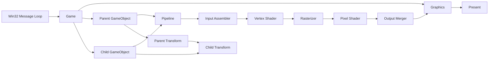

# DirectX 11 Rendering Study

Win32와 DirectX 11을 이용해 렌더링 파이프라인을 직접 구성하고,  
GPU 리소스 관리부터 계층형 Transform까지 단계적으로 학습한 프로젝트입니다.

화면에 도형을 출력하는 결과만 만드는 것이 아니라, 각 API가 **왜 필요한지**,  
CPU에서 만든 데이터가 **어떤 과정을 거쳐 GPU와 화면으로 전달되는지**를 이해하는 데 집중했습니다.

학습 과정에서 생긴 질문과 답을 코드 주석으로 남겨, 구현의 근거와 사고 과정을 함께 확인할 수 있도록 했습니다.

## 프로젝트 목표

- DirectX 11 초기화 과정과 각 객체의 책임 이해
- IA → VS → RS → PS → OM으로 이어지는 렌더링 파이프라인 이해
- CPU와 GPU 사이의 리소스 생성 및 데이터 전달 과정 이해
- 행렬과 Quaternion을 이용한 Local/World Transform 이해
- 기능이 늘어남에 따라 코드를 역할별 클래스로 분리하는 과정 경험

이 프로젝트는 범용 게임 엔진 제작보다, DirectX 11의 기반 개념을 **직접 구현하고 설명할 수 있는 상태로 만드는 것**을 목표로 했습니다.

## 강의 기반과 차별화

이 프로젝트는 인프런 - Rookiss님의 「[게임 프로그래머 도약반] DirectX11 입문」 강의를 기반으로 기본 렌더링 흐름을 학습하며 시작했습니다.

강의 내용을 그대로 재현하는 데서 끝내지 않고, 학습 중 생긴 질문을 주석으로 정리하고 구조와 API 사용을 다시 검토했습니다. 그 과정에서 다음 부분을 별도로 확장하거나 개선했습니다.

- `enum class` 기반 `ShaderScope`와 비트 플래그 연산 지원
- 부모 변경 시 양방향 관계와 하위 World Transform을 한 번에 갱신하도록 `SetParent` 개선
- 부모를 `weak_ptr`로 관리해 Transform 순환 참조 제거
- PCH를 안정적인 공용 헤더 중심으로 정리하고 헤더 의존성을 명시적으로 분리
- 광범위한 `using namespace`를 제거하고 DirectX/WRL 타입의 소속을 명시
- Sampler Filter, 읽기 전용 함수의 const 검토 및 Blend Factor 오류 검토 및 수정

### Scoped Enum과 Shader Scope

강의 코드와 달리 Shader 적용 범위를 `enum class`로 표현했습니다. 일반 `enum`처럼 열거자 이름이 전역 범위에 노출되는 것을 피하면서, 암시적인 정수 변환도 제한하기 위한 선택입니다.

```cpp
enum class ShaderScope
{
    None         = 0,
    VertexShader = (1 << 0),
    PixelShader  = (1 << 1),
};

DEFINE_ENUM_FLAG_OPERATORS(ShaderScope);
```

`enum class`는 기본적으로 비트 연산자를 제공하지 않으므로 `DEFINE_ENUM_FLAG_OPERATORS`로 연산을 지원했습니다. 이를 통해 하나의 값에 여러 Shader Stage를 함께 표현할 수 있습니다.

```cpp
ShaderScope scope =
    ShaderScope::VertexShader | ShaderScope::PixelShader;
```

Pipeline에서는 각 비트를 독립된 `if`로 검사해 VS와 PS가 동시에 지정된 경우 두 Stage에 모두 리소스를 바인딩합니다.

관련 코드: [Shader.h](./DirectX11Workspace/Shader.h), [Pipeline.h](./DirectX11Workspace/Pipeline.h)

### PCH와 헤더 의존성 정리

PCH를 프로젝트 전체 include 목록처럼 사용하지 않고, 여러 번 사용되며 변경이 적은 Windows/DirectX 및 표준 라이브러리 헤더만 보관하도록 정리했습니다.

- 사용하지 않는 `list`, `map`, `unordered_map` 제거
- `Graphics`, `VertexBuffer`, `IndexBuffer`, `InputLayout` 등 프로젝트 클래스 제거
- Texture 구현에서만 필요한 DirectXTex를 `Texture.cpp`로 이동
- Shader 구현에서만 필요한 D3DCompiler를 `Shader.cpp`로 이동
- 각 헤더가 사용하는 타입을 직접 include하거나 전방 선언
- `using namespace DirectX`, `using namespace Microsoft::WRL` 제거
- `Microsoft::WRL::ComPtr`, `DirectX::XMQuaternionInverse`처럼 타입과 함수의 소속 명시
- 라이브러리 링크 설정을 PCH에서 Visual Studio 프로젝트 설정으로 이동

이를 통해 PCH는 컴파일 비용을 줄이는 캐시 역할만 담당하고, 각 파일의 실제 의존성은 코드에서 확인할 수 있도록 했습니다.

관련 코드: [pch.h](./DirectX11Workspace/pch.h), [Texture.cpp](./DirectX11Workspace/Texture.cpp), [Shader.cpp](./DirectX11Workspace/Shader.cpp)

## 실행 결과

- Index Buffer를 이용한 텍스처 사각형 렌더링
- 두 텍스처를 알파값에 따라 혼합
- 부모 오브젝트 이동
- 자식 오브젝트 회전
- 부모 Transform 변경에 따른 자식 World Transform 재계산


- 확장된 UV 좌표와 Sampler를 이용한 텍스처 반복
- 부모 이동에 따른 자식 World Position 갱신
- 부모의 Transform을 상속하면서 자식의 Local Rotation 유지

를 확인할 수 있습니다.

## 주요 구현

### DirectX 11 초기화

- Win32 창 생성 및 메시지 루프 구성
- D3D11 Device와 DeviceContext 생성
- DXGI SwapChain 구성
- Back Buffer 기반 Render Target View 생성
- Viewport 설정 및 Present

관련 코드: [Graphics.cpp](./DirectX11Workspace/Graphics.cpp), [DirectX11Workspace.cpp](./DirectX11Workspace/DirectX11Workspace.cpp)

### 렌더링 파이프라인

- Input Layout과 Primitive Topology 설정
- Vertex/Pixel Shader 바인딩
- Rasterizer, Sampler, Blend State 구성
- Vertex/Index/Constant Buffer 및 Texture 바인딩
- `PipelineInfo`를 이용한 파이프라인 상태 묶음 관리

관련 코드: [Pipeline.cpp](./DirectX11Workspace/Pipeline.cpp), [Pipeline.h](./DirectX11Workspace/Pipeline.h)

### GPU 리소스 래핑

DirectX API 객체를 기능별 클래스로 분리했습니다.

| 구분 | 역할 |
| --- | --- |
| `VertexBuffer` | 정점 데이터를 GPU 버퍼로 생성 |
| `IndexBuffer` | 정점 조립 순서를 GPU 버퍼로 생성 |
| `ConstantBuffer<T>` | CPU에서 갱신한 데이터를 Shader Constant Buffer로 전달 |
| `InputLayout` | C++ 정점 구조와 Vertex Shader 입력 형식 연결 |
| `Shader` | HLSL 컴파일 및 Vertex/Pixel Shader 생성 |
| `Texture` | DirectXTex를 이용한 이미지 로딩과 SRV 생성 |
| `RasterizerState` | Fill/Cull/Depth Clip 상태 관리 |
| `SamplerState` | Texture Address Mode와 Filter 관리 |
| `BlendState` | 렌더 타깃의 색상 혼합 방식 관리 |

### Geometry와 텍스처 렌더링

- 정점 4개와 Index 6개로 사각형 생성
- Position/UV 기반 Input Layout 구성
- DirectXTex의 WIC 로더로 PNG/JPG 로딩
- HLSL에서 두 텍스처를 샘플링하고 알파값으로 혼합

관련 코드: [GeometryHelper.cpp](./DirectX11Workspace/GeometryHelper.cpp), [Default.hlsl](./DirectX11Workspace/Default.hlsl)

### Transform 계층 구조

- Scale → Rotation → Translation 순서로 Local Matrix 구성
- 부모 World Matrix를 이용한 자식 World Matrix 계산
- 완성된 World Matrix에서 Scale, Rotation, Position 분해
- World Position을 설정할 때 부모 World Matrix의 역행렬로 Local Position 계산
- Quaternion 기반 회전
- 부모 변경 시 이전 부모와 새 부모의 자식 목록을 함께 갱신
- 부모는 `weak_ptr`, 자식은 `shared_ptr`로 관리해 순환 참조 방지
- 부모가 변경되면 하위 Transform을 재귀적으로 갱신

관련 코드: [Transform.cpp](./DirectX11Workspace/Transform.cpp), [Transform.h](./DirectX11Workspace/Transform.h)

## 구조



## 주석으로 남긴 학습 기록

이 프로젝트에서 주석은 코드의 동작을 다시 읽어주는 설명보다, 제가 학습하는 중 생긴 **“왜?”에 대한 답**을 기록하는 데 사용했습니다.

### Resource와 View의 관계

Texture2D 같은 Resource는 GPU 메모리에 저장된 데이터이고, RTV와 SRV는 그 데이터를 파이프라인에서 어떤 용도로 해석할지 설명한다는 관점으로 정리했습니다.

- Back Buffer를 Render Target으로 해석하는 과정: [Graphics.cpp](./DirectX11Workspace/Graphics.cpp)
- 이미지 Resource를 Shader에서 읽도록 만드는 과정: [Texture.cpp](./DirectX11Workspace/Texture.cpp)

### CPU에서 GPU로 데이터가 이동하는 과정

정적 정점 데이터에는 `IMMUTABLE`, 매 프레임 변경되는 Constant Buffer에는 `DYNAMIC`과 `Map/Unmap`을 사용한 이유를 코드와 함께 기록했습니다.

- 정적 Vertex Buffer 생성: [VertexBuffer.h](./DirectX11Workspace/VertexBuffer.h)
- 동적 Constant Buffer 갱신: [ConstantBuffer.h](./DirectX11Workspace/ConstantBuffer.h)

### 파이프라인 단계별 역할

Input Layout, Shader Resource, Sampler, Constant Buffer가 각각 어떤 레지스터 및 파이프라인 단계와 연결되는지 구현 위치에 설명을 남겼습니다.

- C++ 파이프라인 바인딩: [Pipeline.cpp](./DirectX11Workspace/Pipeline.cpp)
- HLSL의 `b`, `t`, `s` 레지스터: [Default.hlsl](./DirectX11Workspace/Default.hlsl)

### Local과 World Transform

단순히 행렬 공식을 적용하는 데서 끝내지 않고, 부모의 회전과 크기까지 반영된 좌표를 World에서 Local로 변환하려면 왜 부모 World Matrix의 역행렬이 필요한지 정리했습니다.

- Local/World Matrix 계산과 재귀 갱신: [Transform.cpp](./DirectX11Workspace/Transform.cpp)
- Transform 데이터와 인터페이스: [Transform.h](./DirectX11Workspace/Transform.h)

### 추가로 살펴볼 학습 기록

README에서는 대표적인 주제만 추렸습니다. 아래 파일에도 구현 과정에서 정리한 학습 메모가 있습니다. 결과 코드뿐 아니라 각 개념을 이해해 가는 과정도 함께 봐주시면 감사하겠습니다.

| 주제 | 주석에 정리한 내용 | 관련 코드 |
| --- | --- | --- |
| Index Buffer와 Geometry | 정점 재사용, 인덱스 순서와 앞면 판정, CPU 측 Geometry 데이터 분리 | [IndexBuffer.cpp](./DirectX11Workspace/IndexBuffer.cpp), [Geometry.h](./DirectX11Workspace/Geometry.h), [GeometryHelper.cpp](./DirectX11Workspace/GeometryHelper.cpp) |
| Rasterizer | Fill/Cull 모드, 앞면을 판정하는 정점 순서, Rasterizer 단계의 클리핑 | [RasterizerState.cpp](./DirectX11Workspace/RasterizerState.cpp) |
| Sampler State | UV 범위 밖의 Address Mode와 일반 Linear Filter·Comparison Filter의 차이 | [SamplerState.cpp](./DirectX11Workspace/SamplerState.cpp) |
| Constant Buffer 데이터 구성 | 상수 버퍼의 16바이트 단위 규칙과 World·View·Projection 데이터 구성 | [Struct.h](./DirectX11Workspace/Struct.h), [ConstantBuffer.h](./DirectX11Workspace/ConstantBuffer.h) |
| DirectXMath와 SimpleMath | `XMFLOAT`, `XMVECTOR`, SimpleMath 타입을 사용하는 이유와 좌표계 주의점 | [Types.h](./DirectX11Workspace/Types.h) |

## 학습 과정

| 단계 | 학습 및 구현 내용 |
| --- | --- |
| 1 | DirectX 11과 DirectXTex 개발 환경 구성 |
| 2 | Device, DeviceContext, SwapChain 초기화 |
| 3 | Input Layout과 VS/PS를 이용한 삼각형 렌더링 |
| 4 | Index Buffer와 Texture를 이용한 사각형 렌더링 |
| 5 | Constant Buffer를 이용한 오브젝트 이동 |
| 6 | Rasterizer, Sampler, Blend State 구현 |
| 7 | WVP 행렬과 SimpleMath 적용 |
| 8 | 렌더링 기능을 역할별 클래스로 리팩터링 |
| 9 | GameObject 구조로 오브젝트 데이터 분리 |
| 10 | Transform 컴포넌트와 부모-자식 계층 구현 |

## 학습 중 발견하고 수정한 문제

- 부모와 자식 Transform이 서로를 `shared_ptr`로 소유하던 순환 참조를 `weak_ptr`과 `enable_shared_from_this`클래스의 상속을 통해 제거
- 일반 색상 샘플링에 Comparison Filter를 사용하던 문제 수정
- Blend Factor를 API가 요구하는 RGBA 4개 값으로 수정
- 객체를 변경하지 않는 함수들에 대해 const 한정자를 적용
- 불필요한 PCH 의존성과 전역 namespace 오염 제거

이 과정을 통해 API를 호출하는 것뿐 아니라, **API가 요구하는 데이터 형식과 객체 소유 관계, 상태 변경의 일관성까지 검토하는 경험**을 얻었습니다.

## 개발 환경

- Windows 10/11
- Visual Studio 2022
- C++17
- DirectX 11
- HLSL Shader Model 5.0
- DirectXMath SimpleMath
- DirectXTex
- x64 Debug

## 빌드 및 실행

1. Visual Studio 2022에서 `DirectX11Workspace.sln`을 엽니다.
2. 구성을 `Debug | x64`로 설정합니다.
3. 프로젝트를 빌드하고 실행합니다.

Shader와 Texture를 상대 경로로 불러오므로 Visual Studio에서 프로젝트 디렉터리를 작업 경로로 실행해야 합니다.

## 앞으로 개선/구현해나갈 점

- Delta Time 기반 Transform 갱신
- Mesh, Material, Shader 리소스 응용
- 창 크기 변경에 따른 SwapChain 및 Viewport 재설정
- Depth Buffer와 Camera 구현
- Component 소유 관계 및 관리 기능 확장

### Asset Credits

Skeleton.png, Golem.png 이미지는 OpenGameArt의 공개 에셋을 사용했습니다.

- UndeadFighter — BlackSwordo, OpenGameArt, CC BY 3.0
- Cursed Lava Golem Knight — VoyPix, OpenGameArt, CC BY 3.0
